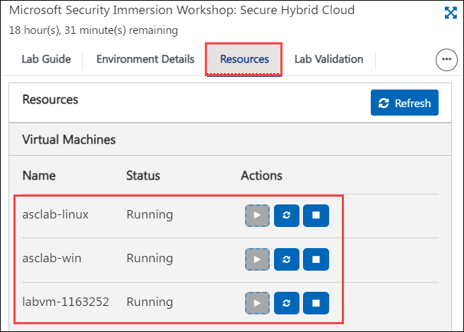
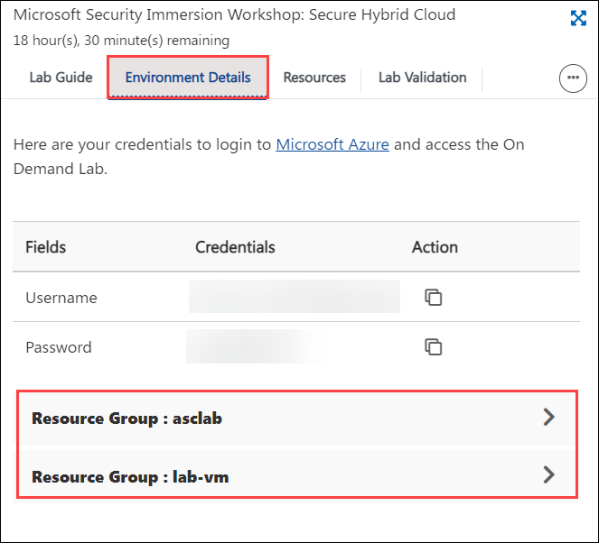
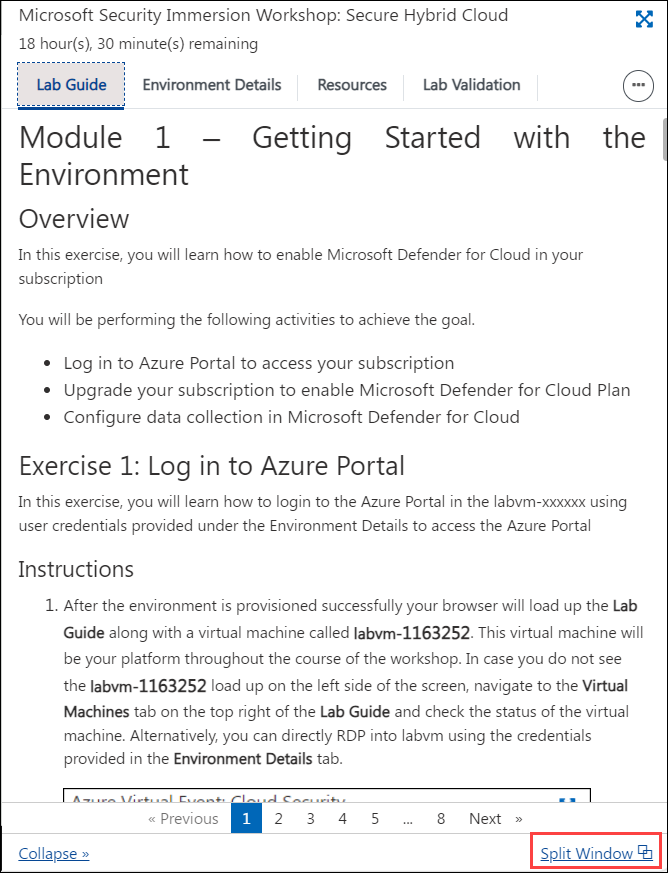

# Module 1 – Getting Started with the Environment

## Overview

In this exercise, you will learn how to enable Microsoft Defender for Cloud in your subscription

You will be performing the following activities to achieve the goal:

  - Log in to Azure Portal to access your subscription
  - Upgrade your subscription to enable Microsoft Defender for Cloud Plan
  - Configure data collection in Microsoft Defender for Cloud

## Exercise 1: Log in to Azure Portal

In this exercise, you will learn how to login to the Azure Portal in the labvm-xxxxxx using user credentials provided under the Environment Details to access the Azure Portal

### Instructions 

1. After the environment is provisioned successfully, your browser will load up the **Lab Guide** along with a virtual machine called **labvm-<inject key="DeploymentID" enableCopy="false"/>**. This virtual machine will be your platform throughout the course of the workshop. In case you do not see the **labvm-<inject key="DeploymentID" enableCopy="false"/>** load up on the left side of the screen, navigate to the **Virtual Machines** tab on the top right of the **Lab Guide** and check the status of the virtual machine. Alternatively, you can directly RDP into LabVM using the credentials provided in the **Environment Details** tab.

    

1. All user credentials for accessing the **Azure Portal** can be viewed under the **Environment Details** tab for ease of access. Do note that the same information will also be sent to your registered email address. 

    

1. The Lab Guide can also be opened on a separate window by selecting the **Split Window** icon in the bottom right corner. This will result in the window detaching from the right side providing more on-screen space for your virtual machine.

    

### Login to Azure Portal 

1. In the **labvm**, Launch **Azure Portal** using the desktop icon.

1. Now you should be on the **Microsoft Azure** login screen. Enter the following username and click on **Next**.  

   * Email/Username: <inject key="AzureAdUserEmail"></inject> 

         

1. Enter the following password and click on **Sign in**. 

   * Password: <inject key="AzureAdUserPassword"></inject> 

         

1. You may get a **Help us protect your account** box; on that, click on **Ask later**.

     
 
1. First-time users are often prompted to request access to **Stay Signed in**. If you see any such pop-up window, click on **No**.

1. If you see any additional pop-up like, You have free **Azure Advisor recommendations!** Close the window to continue the lab.

## Exercise 2: Enabling Microsoft Defender for Cloud

In this exercise, you will be getting started with the functionality of Microsoft Defender for Cloud and how to enable Microsoft Defender for Cloud on a subscription.

### Subscription upgrade and agent installation

1. Type **Microsoft Defender for Cloud** in the search box on top of the **Azure Portal** and click to open it.

    

1. Click on **Getting started (1)** from the left pane. Click on the **Upgrade (2)** tab, select your **Log Analytics workspace as asclab-la-XXXXX (3)**, and click **Upgrade (4)**.

    > **Note:** If you are not able to see the Log Analytics workspace, then it means your subscription is already upgraded, In this case, you can skip steps 2, and 3 and continue from step 4. Also, you might have to wait for a few seconds to have the upgrade button visible.

        

1. Click on **Install agents**. 

    
   
    > **Note:** If the button is greyed out, then it's already set to **On** and agents are already installed. In this case you can move on to the next step.

    

### Configure the data collection settings in Microsoft Defender for Cloud

1. Go to the **Microsoft Defender for Cloud** and Click on the **Environment settings** page and select your **Azure subscription**.

    

1. From **Settings | Defender Plans** page, Navigate to  **Settings & monitoring**.

    

1. On the **Settings & monitoring** toggle the status of **Log Analytics agent/Azure Monitor agent** to **On** (if it is not already set to On). Click on **Edit configuration** under the **Configuration** header of the Log Analytics agent/Azure Monitor agent.

    
    
1. A new window of Auto-provisioning configuration is opened. Select **Log Analytics Agent (Default)** for **Agent type**, under **Workspace selection** select **Custom workspace** and choose your workspace from the drop-down menu and click **Apply**.

     
  

1. Once all the configurations are made, click on **Continue**.

    
    
1. Click on **Save**. 

    

 

> Please notice:
> * To get the full functionality of Microsoft Defender for Cloud, both subscription and Log Analytics workspace should be enabled for Defender. Once you enable it,  the required Log Analytics solutions will be added to the workspace.
> * Before clicking on the Upgrade button, you can review the total number of resources you are going to enable on Microsoft Defender for Cloud.
> * You can enable the Microsoft Defender for Cloud trial for 30 days on a subscription-only, if not previously used.

## Exercise 3: Creating Microsoft Defender for Cloud Default policy.

In this exercise, You will create the Microsoft Defender for Cloud default policy in the security policy under  Microsoft Defender for Cloud.

1. From Azure Portal, search for **Microsoft Defender for Cloud** and select it.
   
1. In Microsoft Defender for Cloud blade, Click on the  **Environment Settings** and select your subscription.

    
   
1. Click on **Security policies (1)** under Settings You'll notice that **Microsoft cloud security benchmark (2)** has been created automatically. Explore the policy by clicking on the policy.

    
   
   > **Note**: Verify that Toggle button status for Microsoft cloud security benchmark is set to **On**.
    
## Summary

  In this module, you have learned how to enable Microsoft Defender for Cloud. Now you can move on to the next module by clicking on the Next button at the bottom right of this page.
